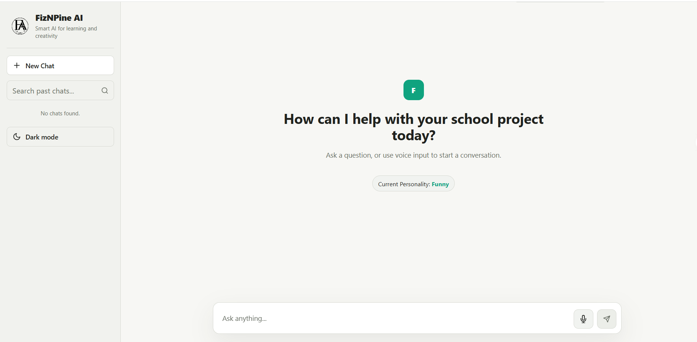
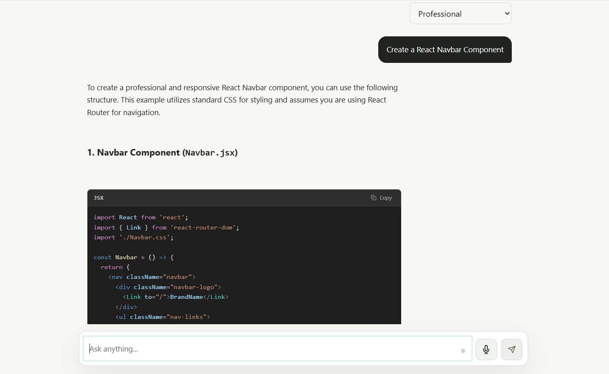
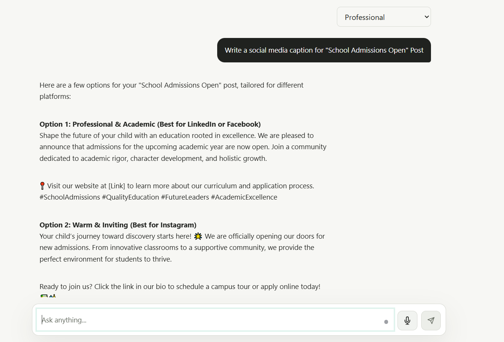
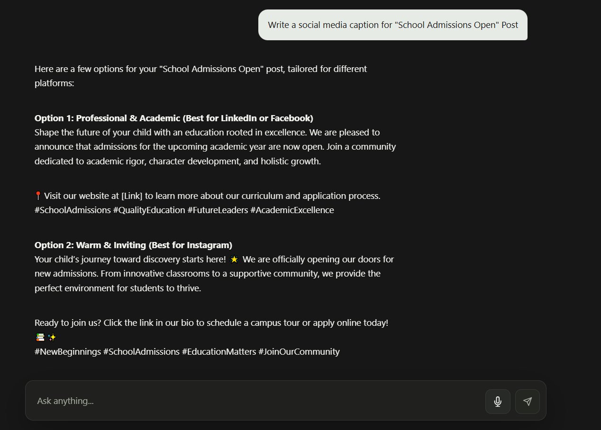
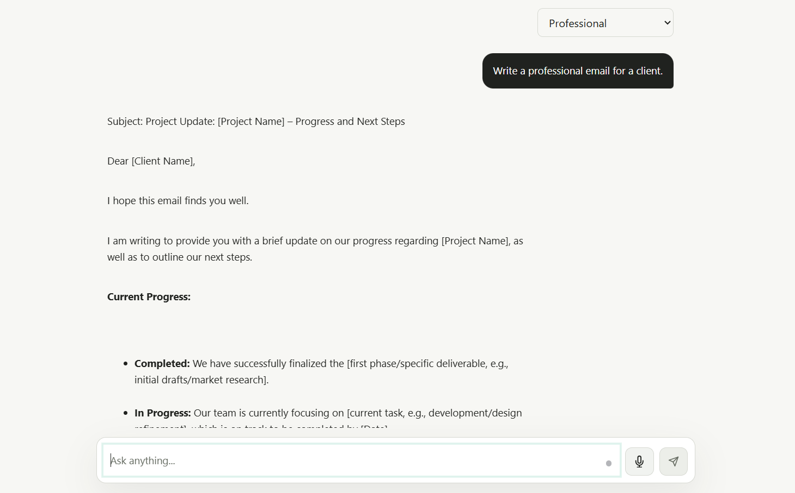

# FizNPine AI

## Overview

FizNPine AI is an intelligent AI-powered chatbot built to provide fast, natural, and engaging conversations using Google's Gemini API. The project features a modern user interface, responsive design, and seamless AI interaction.

## Preview

An AI chatbot capable of answering questions, assisting users, and providing conversational support through an intuitive web interface.

## 📸 Screenshots

| Homepage | Coding |
|-----------|---------|
|  |  |

| Content Writing | Dark Mode |
|-----------|---------|
|  |  |

| AI Assistant | Mobile View |
|-----------|---------|
|  |  |

## Features

* AI-powered conversations using Gemini API
* Modern and responsive user interface
* Dark and light mode support
* Real-time chat experience
* Mobile-friendly design
* Fast and lightweight architecture

## Technologies Used

* Node.js
* Express.js
* JavaScript
* HTML5
* CSS3
* Gemini API

## Live Demo
https://fiz-n-pine-ai-new-8r4c.vercel.app/

## GitHub Repository
https://github.com/fizzajabeen13/FizNPine-AI-New

## Author

Fizza Jabeen
